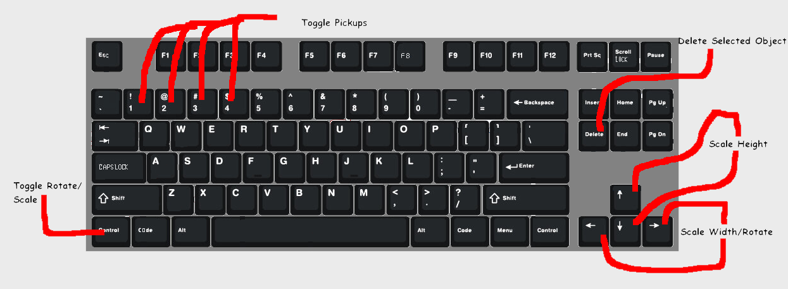
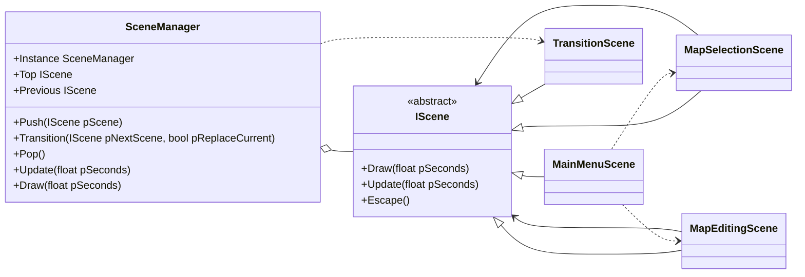
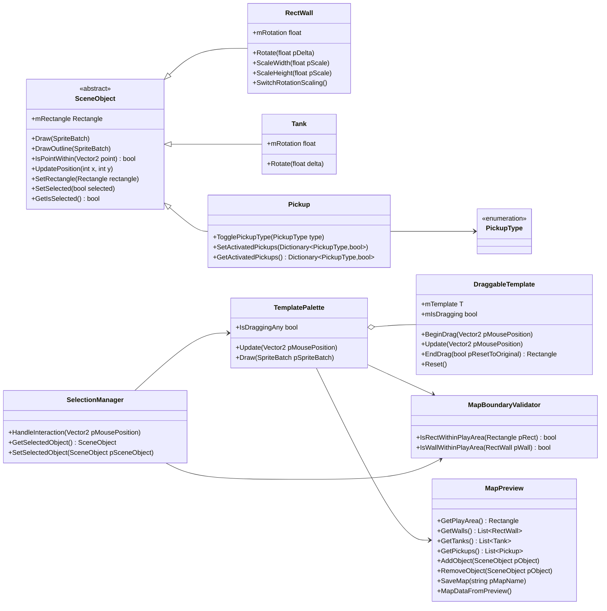
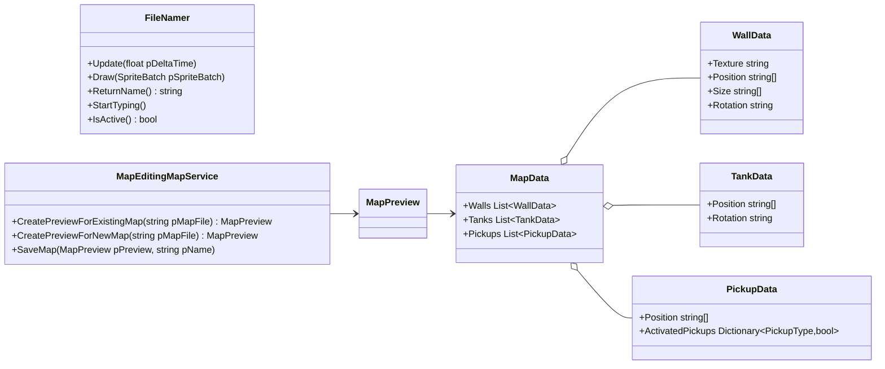

# Troublesome Tanks Map Editor

For the game a map editor was created. This is a separate application which will allow you to create maps to be used within the game.

## How to setup
Add the folder to a common folder which also has a folder which contains the tankontroller which holds the game. Load the editor executable. When Cloning the repository, this layout will already be in place, so the map loading will work.

## The controls

### Keyboard

These are the controls for the map editor when using a keyboard, which is currently the only control option.

- Uses drag and drop system in editing scene.
- Objects selected by clicking and holding on the object with the mouse.
- When an object is selected can interact with them using the keyboard.
- Can navigate the menu using arrow keys.
- Left/Right move in that direction in the menu if supported.
- Up/Down move in that direction in the menu if supported.
- Pressing enter will select the menu option.

### Solution Diagrams

### Scene Management - Class Diagram

### SceneObject Interaction - Class Diagram

### Map Editing Service - Class Diagram

